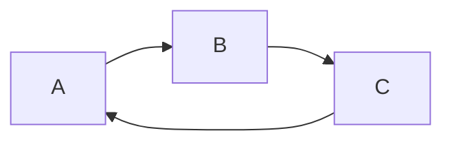
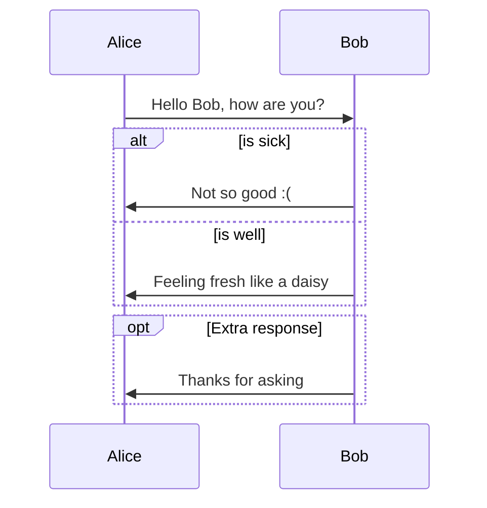

```
graph TD;
    A-->B;
    A-->C;
    B-->D;
    C-->D;
```




# This is an H1

## This is an H2

###### This is an H6

> This is a blockquote with two paragraphs. This is first paragraph.
>
> This is second pragraph. Vestibulum enim wisi, viverra nec, fringilla in, laoreet vitae, risus.


> This is another blockquote with one paragraph. There is three empty line to seperate two blockquote.


## un-ordered list
*   Red
*   Green
*   Blue

## ordered list
1.  Red
2. 	Green
3.	Blue

- [x] a task list item
- [ ] list syntax required
- [ ] normal **formatting**, @mentions, #1234 refs
- [ ] incomplete
- [x] completed

Here's an example:

```
function test() {
  console.log("notice the blank line before this function?");
}
```

syntax highlighting:
```ruby
require 'redcarpet'
markdown = Redcarpet.new("Hello World!")
puts markdown.to_html
```

Use the `printf()` function.

:smile: